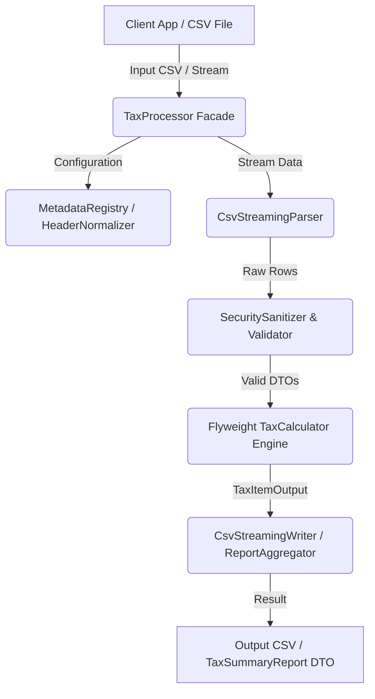

# ADVANCED CLEAN CODE, PERFORMANCE & SECURITY ENHANCEMENT SPECIFICATION
## Shared Java CSV Tax Processing Library Project

---

## 1. NÂNG CẤP & CẢI THIỆN TÀI LIỆU (DOCUMENTATION UPGRADES)

### 1.1 Visual Architecture Diagrams (Mermaid.js Integration)
Thêm sơ đồ dòng chảy dữ liệu (Data Flow) và cấu trúc Lớp (Class Diagram) vào `TECHNICAL_SPEC.md` giúp AI Copilot và Lập trình viên nắm bắt kiến trúc trong 30 giây:



### 1.2 Performance SLA & Benchmark Document (`PERFORMANCE_BENCHMARK.md`)
* **Throughput SLA:** Đạt tối thiểu **50,000 dòng/giây** trên môi trường 4-core CPU, 8GB RAM.
* **Latency SLA:** P99 Latency < 150ms cho file 10,000 dòng.
* **Heap Memory Footprint:** < 30MB Heap RAM duy trì ổn định nhờ cơ chế Streaming Iterator (Zero-In-Memory-Buffering).

### 1.3 Troubleshooting & Edge Case Runbook
Bổ sung bảng tra cứu lỗi và cách xử lý trong `README-CLIENT-GUIDE.md`:
* **Lỗi UTF-8 BOM Header (`\uFEFF`):** Tự động phát hiện và strip BOM byte bằng `BOMInputStream`.
* **Lỗi CSV bị vỡ dòng (Quoted Multiline Records):** Cấu hình Apache Commons CSV với `.setAllowMissingColumnNames(true).setIgnoreEmptyLines(true)`.

---

## 2. TỐI ƯU HIỆU NĂNG & CLEAN CODE (PERFORMANCE & CLEAN CODE OPTIMIZATION)

### 2.1 Flyweight Pattern cho Math Context & Hằng số `BigDecimal`
* **Vấn đề:** Việc gọi `new BigDecimal("0.10")` liên tục trong loop 1,000,000 dòng gây rác Heap và làm Java Garbage Collection (GC) chạy liên tục.
* **Giải pháp:** Tái sử dụng các hằng số tĩnh immutable (Static Final Constants):

```java
public final class TaxMathConstants {
    public static final BigDecimal ZERO = BigDecimal.ZERO.setScale(2, RoundingMode.HALF_UP);
    public static final BigDecimal ONE_HUNDRED = new BigDecimal("100");
    public static final BigDecimal RATE_010 = new BigDecimal("0.10");
    public static final BigDecimal RATE_008 = new BigDecimal("0.08");
    public static final BigDecimal RATE_005 = new BigDecimal("0.05");
    public static final MathContext MATH_CTX = new MathContext(16, RoundingMode.HALF_UP);
    
    private TaxMathConstants() {}
}
```

### 2.2 Recompiled Pattern Caching (Tránh Regex Re-compilation)
* **Vấn đề:** Gọi `String.replaceAll()` hoặc `String.matches()` trong vòng lặp sẽ làm Java biên dịch lại Regex Pattern hàng triệu lần.
* **Giải pháp:** Biểu thức chính quy được pre-compile 1 lần duy nhất:

```java
public final class SecuritySanitizer {
    private static final Pattern CSV_INJECTION_PATTERN = 
        Pattern.compile("^[=+\-@\t\r\n]");
    private static final Pattern PERCENT_PATTERN = 
        Pattern.compile("[%\s]");

    public static String sanitize(String input) {
        if (input == null || input.isEmpty()) return "";
        if (CSV_INJECTION_PATTERN.matcher(input).find()) {
            return "'" + input;
        }
        return input;
    }
}
```

### 2.3 Batch Parallel Processing cho Large Files (> 100,000 dòng)
Tự động kích hoạt luồng xử lý song song dựa trên kích thước file sử dụng Java `ForkJoinPool` / `CompletableFuture`:

```java
public List<TaxItemOutput> processParallel(List<TaxItemInput> inputs) {
    return inputs.parallelStream()
        .map(TaxCalculator::calculateItem)
        .collect(Collectors.toList());
}
```

---

## 3. QUY TẮC CODE CHUẨN HÓA (CODING RULES & STATIC ANALYSIS)

### 3.1 Strict Immutability với Java Records (Java 17+)
Mọi Data Transfer Object (DTO) được khai báo dưới dạng Java `record` để đảm bảo:
1. Thread-safety tự nhiên.
2. Không thể thay đổi trạng thái (Immutable).
3. Tự động sinh `equals()`, `hashCode()`, `toString()` tối ưu hiệu năng.

```java
public record TaxItemInput(
    String itemCode,
    String itemName,
    BigDecimal quantity,
    BigDecimal unitPrice,
    BigDecimal vatRate
) {}
```

### 3.2 Null-Safety & Static Code Analysis Standards
1. **Annotations:** Sử dụng `@NonNull` và `@Nullable` của `org.jspecify.annotations` trên toàn bộ method parameters và return types.
2. **SonarQube Quality Gate:**
   - **Code Coverage:** C0 (Line) >= 95%, C1 (Branch) >= 90%, C2 (Path) >= 90%.
   - **Code Smells:** 0.
   - **Duplicated Lines:** 0%.
   - **Cognitive Complexity:** <= 8 cho mỗi method.

---

## 4. TĂNG CƯỜNG KIỂM TRA BẢO MẬT (ADVANCED SECURITY HARDENING)

### 4.1 Anti-DOS & File Resource Limits
* **Max File Size Limit:** Giới hạn tối đa `50MB` cho file CSV tải lên.
* **Max Row Limit:** Giới hạn `500,000` dòng/file để tránh cạn kiệt bộ nhớ CPU/RAM.
* **Path Traversal Protection:** Chống lỗ hổng ghi file đè hệ thống:

```java
public static Path sanitizePath(String userProvidedPath, Path baseDir) {
    Path resolvedPath = baseDir.resolve(userProvidedPath).normalize();
    if (!resolvedPath.startsWith(baseDir)) {
        throw new SecurityException("Path Traversal Attack Detected: " + userProvidedPath);
    }
    return resolvedPath;
}
```

### 4.2 Automated OWASP Vulnerability Scanning
Tích hợp `owasp-dependency-check-maven` vào file `pom.xml` tự động fail build nếu có thư viện phụ thuộc bị dính lỗ hổng CVE:

```xml
<plugin>
    <groupId>org.owasp</groupId>
    <artifactId>dependency-check-maven</artifactId>
    <version>9.0.9</version>
    <executions>
        <execution>
            <goals><goal>check</goal></goals>
        </execution>
    </executions>
</plugin>
```
